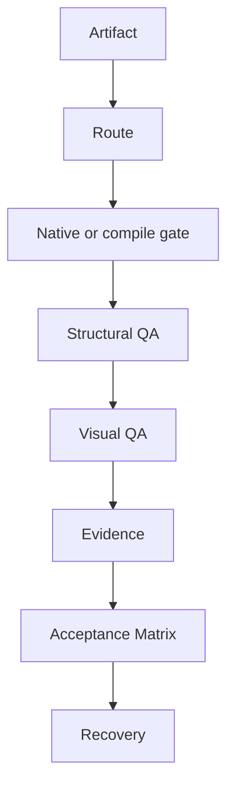

# Academic Workstation

> An evidence-first orchestration skill for routing, generating, natively validating, visually inspecting, and safely delivering research and Office artifacts.

Current release line: **v0.2.0**. It adds executable Word, Excel, Visio, LaTeX compilation,
and unified PDF visual-QA contracts on top of the v0.1.0 routing and evidence foundation.

This repository is the shared QA and native-acceptance foundation for the companion
[academic-ppt-workflow](https://github.com/Confidence-huang/academic-ppt-workflow) and
[academic-paper-workflow](https://github.com/Confidence-huang/academic-paper-workflow) repositories.
It does not vendor their workflow Skills, specialist implementations, Office applications, or
private acceptance outputs.

Academic Workstation coordinates specialist tools around a research or Office deliverable.
It makes the artifact shape, requested target, acceptance depth, fallback reason, provenance,
and final status explicit. It is an orchestrator, not a replacement for PowerPoint, Word,
Excel, PDF, Visio, or LaTeX tooling.

## The operating flow

~~~text
Route → Build → Structural QA → Native Roundtrip → Export/Render → Visual QA → Evidence → Final Status
~~~

Generation is L0. A file is not treated as deliverable evidence until the applicable
structural, native, render, visual, and evidence gates have been run or explicitly marked
NOT_RUN, NOT_APPLICABLE, or BLOCKED.

## What it protects

- The user's requested format and tool take precedence.
- Structured SVG, XML, OOXML, charts, tables, and data remain structured whenever the target supports them.
- Fallbacks are explicit and require repeatable downstream QA.
- Native acceptance uses isolated synthetic artifacts and must not disturb user-owned application processes.
- Evidence uses CURRENT_RUN, HISTORICAL_SOURCE, SYNTHETIC_EXAMPLE, or USER_SUPPLIED provenance.
- NOT_RUN and DEFERRED cannot be silently promoted to PASS.
- Public files contain relative evidence paths, sanitized tool names, and no credentials or private workstation roots.

## Quick start

Run these commands from the repository root. The scripts use only the Python standard
library and can also be invoked through uv run python.

~~~bash
python scripts/route_artifact.py --request path/to/route-request.json
python scripts/derive_status.py --input path/to/evidence.json
python scripts/validate_evidence.py --input path/to/evidence.json --root path/to/artifacts
python scripts/hash_artifacts.py --root path/to/artifacts --output path/to/manifest.json
python scripts/compare_manifests.py --expected path/to/manifest.json --actual path/to/restored.json
python scripts/recovery_rehearsal.py --source-root . --backup-root <private-backup-root> --restore-root private-restore --output private-evidence/recovery.json
python scripts/acceptance_matrix.py --evidence-dir private-evidence --recovery-evidence private-evidence/recovery.json --output private-evidence/matrix.json
python scripts/compile_latex.py --source examples/latex/main.tex --output-dir private-evidence/latex
python scripts/pdf_qa.py --pdf private-evidence/latex/main.pdf --root private-evidence/latex
python tests/runtime.py
python tests/behavior.py
python -m unittest discover -s tests -p 'test_*.py'
python scripts/scan_public_repo.py --root . --strict
~~~

The capability detector reports conservative signals without launching native applications.
Its output is a discovery hint, never native acceptance evidence.

## Architecture

The Workstation owns shared evidence, status, PDF, visual, and recovery interfaces. A companion
workflow owns its domain-specific route and source-authority rules; it does not duplicate this
acceptance implementation.

## Academic Artifact Acceptance Matrix

The machine-readable matrix has five stable rows: PPTX, DOCX, XLSX, VSDX, and LaTeX/PDF.
Its columns are Generate, Parse, Native Open, Roundtrip, Export, Structural QA, Visual QA,
Evidence, and Recovery. A PDF QA record with `sourceArtifactType: latex` is merged into the
LaTeX/PDF row; a missing or unrun gate remains visible. See
[references/acceptance-matrix.md](references/acceptance-matrix.md) and
[schemas/acceptance-matrix.schema.json](schemas/acceptance-matrix.schema.json).

The native Office pilot is Windows-only and creates synthetic files in a private staging root:

~~~powershell
pwsh -NoProfile -ExecutionPolicy Bypass -File scripts/native_acceptance.ps1 `
  -Artifact all `
  -OutputRoot <native-output-root> `
  -VisualReviewRoot <visual-review-root> `
  -RecoveryEvidence <recovery-evidence-file>
~~~

The runner uses isolated COM instances, preserves user-owned processes, records fallbacks and
relative hashes, refuses to call a missing visual review a pass, and accepts only a verified
project recovery record for L6. LaTeX and PDF tools remain host-dependent; an executable path
is never treated as native acceptance by itself.

## Acceptance vocabulary

| Status | Meaning |
| --- | --- |
| PASS | Required checks passed and no open warning/deferred item remains. |
| PASS_WITH_WARNING | No required failure remains, but a warning, deferred item, or unrun optional check remains. |
| FAIL | A required check failed or was not run. |
| BLOCKED | An external blocker prevents the required action. |
| NOT_RUN | A check was not executed; it is not a pass. |
| NOT_APPLICABLE | The check is outside the artifact's accepted scope. |

## Repository map

- SKILL.md — invocation boundary and orchestration contract.
- agents/openai.yaml — Codex display metadata and default prompt.
- scripts/ — deterministic routing, status, hashing, evidence, capability, native Office, LaTeX, PDF, recovery, and matrix gates.
- schemas/ — machine-readable request, status, evidence, manifest, lifecycle, and matrix shapes.
- references/ — route-specific acceptance and platform rules.
- templates/ — evidence reports that keep claims, artifacts, and provenance separate.
- examples/ — non-research fixtures, including the LaTeX source pilot.
- tests/ — self-bootstrapping runtime, behavior, unit, security, and restore checks.

## Native application boundary

Native PowerPoint, Word, Excel, Visio, PDF reader, and TeX checks are environment-specific.
The Skill may orchestrate them when available, but it never claims native acceptance from a
static parse, a non-target renderer, or an application path alone. Use the route-specific
references before running a pilot and record the exact fallback if the primary export call
fails.

Known PowerPoint limitation: on some Office builds, `Presentation.ExportAsFixedFormat` has a COM
parameter-binding compatibility issue. A native `Presentation.SaveAs(..., PDF)` fallback is
validated, but its use remains `PASS_WITH_WARNING`; it is never hidden as an unqualified pass.

## Platform matrix

| Capability | Windows | WSL/Linux | Requires Office |
| --- | --- | --- | --- |
| LaTeX compile | Yes, if TeX is installed | Yes, if TeX is installed | No |
| PDF structural/visual QA | Yes | Yes | No |
| Word native acceptance | Yes | Bridge to Windows | Yes |
| Excel native acceptance | Yes | Bridge to Windows | Yes |
| PowerPoint native acceptance | Yes | Bridge to Windows | Yes |
| Visio native acceptance | Yes | Bridge to Windows | Yes |

Native Office results are environment-specific. A host without Office must report the gate as
unavailable or unrun rather than infer a pass from static inspection.

## Security and licensing

Run the publication scanner and review the license attribution record before release.
This repository contains original orchestration code and synthetic fixtures; it does not
vendor specialist Skill implementations or private source artifacts. See SECURITY.md,
references/integrations.md, and references/evidence-and-provenance.md.

Microsoft Office, TeX distributions, fonts, templates, and optional specialist capabilities are
installed separately and retain their own licenses. Public examples use synthetic data only.

## Related workflow repositories

- [academic-ppt-workflow](https://github.com/Confidence-huang/academic-ppt-workflow) — natural-language PPT routing, repair, and delivery contract.
- [academic-paper-workflow](https://github.com/Confidence-huang/academic-paper-workflow) — LaTeX/Word paper routing, source ownership, and citation gates.
- `academic-research-router` remains a local orchestration layer and is intentionally not published.

## Public installation boundary

Clone this repository into any local workspace and run the dependency-free Python checks. The
public checkout is upstream distribution; a user-level Skill installation, if desired, should be
performed through the compatible Skill loader into the user's configured Skill root. Do not make a
local absolute path a runtime requirement.

## Development

The project targets Python 3.10 or newer. A normal development loop is:

~~~bash
uv sync
uv run python -m unittest discover -s tests -p 'test_*.py'
uv run python scripts/scan_public_repo.py --root . --strict
~~~

See CONTRIBUTING.md for the publication gate and CHANGELOG.md for release history.
